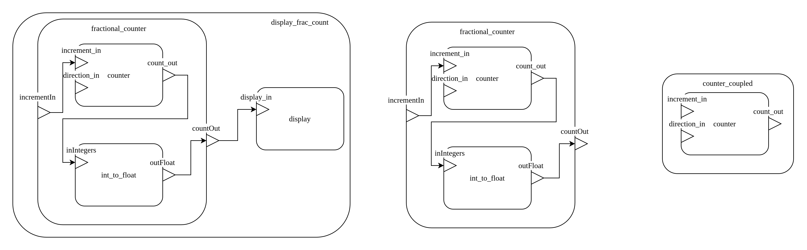

# DEVS Manual Example (RT)
|  Linux | Windows| ESP32 | MSP432 |
|:--|:--|:--|:--|
|:heavy_check_mark:|:heavy_check_mark:|:x:|:x:|

## Introduction
This repository contains the code for the Cadmium Manual

## Dependencies
This project assumes that you have Cadmium installed in a location accessible by the environment variable $CADMIUM.
_This dependency would be met by default if you are using the DEVSsim servers. To check, try `echo $CADMIUM` in the terminal_

## Build
To build this project, run:
```sh
source build_sim.sh
```
__NOTE__: Everytime you run build_sim.sh, the contents of `build/` and `bin/` will be replaced.

## Execute
To run the three models in this project, run:
```sh
./bin/counter_coupled
./bin/fractional_counter
./bin/fractional_counter_display
```

## Repository structure
This repository is arranged in the following manner:

```cpp
.
├── build_sim.sh    //script file to build the models
├── CMakeLists.txt  //CMake configuration for the project
├── main            //main folder containing the code
│   ├── CMakeLists.txt  //CMake configuration for the project
│   ├── include         //include folder containing all the models
│   │   ├── counter_coupled.hpp     //coupled model with only counter
│   │   ├── counter.hpp             //counter atomic model
│   │   ├── display_frac_count.hpp  //2-level coupled model
│   │   ├── display.hpp             //display atomic model
│   │   ├── fractional_counter.hpp  //single level coupled model
│   │   └── int_to_float.hpp        //atomic model that converts int to float
│   ├── main_counter.cpp            //main file to simulate counter coupled
│   ├── main_frac_count_display.cpp //main file to simulate 2-level coupled
│   └── main_frac_counter.cpp       //main file to simulate 1-level coupled
├── cadmium_manual_models.png       //diagram of the models in this repo
└── README.md                       //this file
```

## Coupled models in this repository


The figure above shows the diagram of the three models included in the repo.
